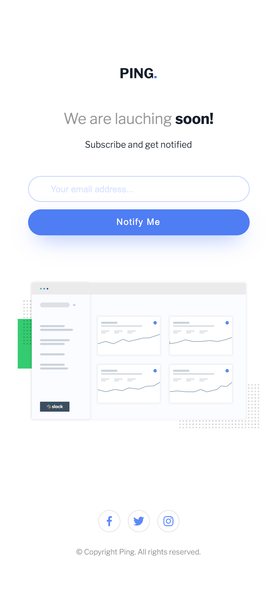
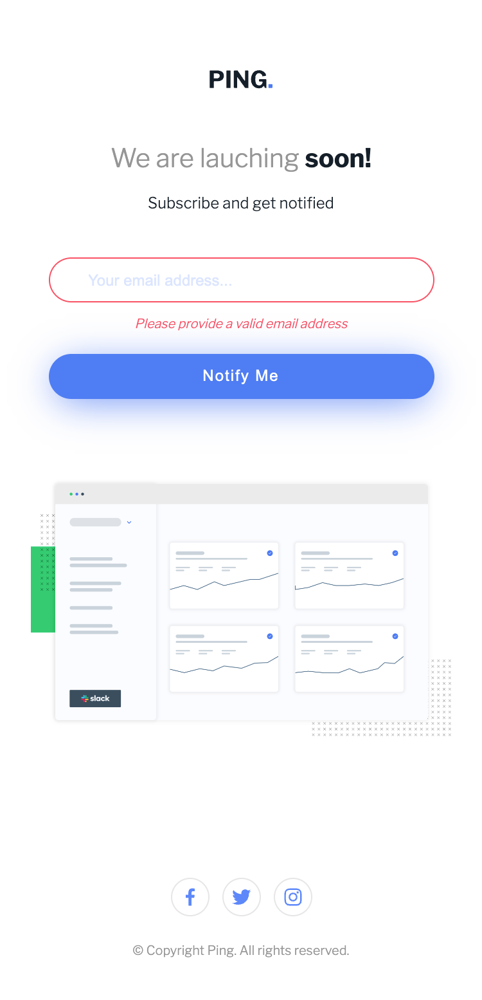
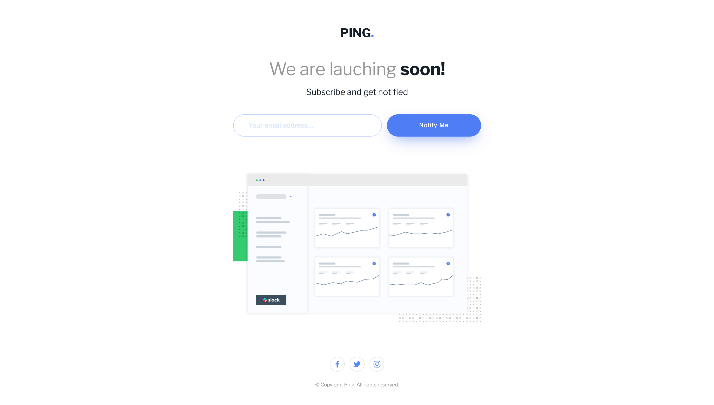
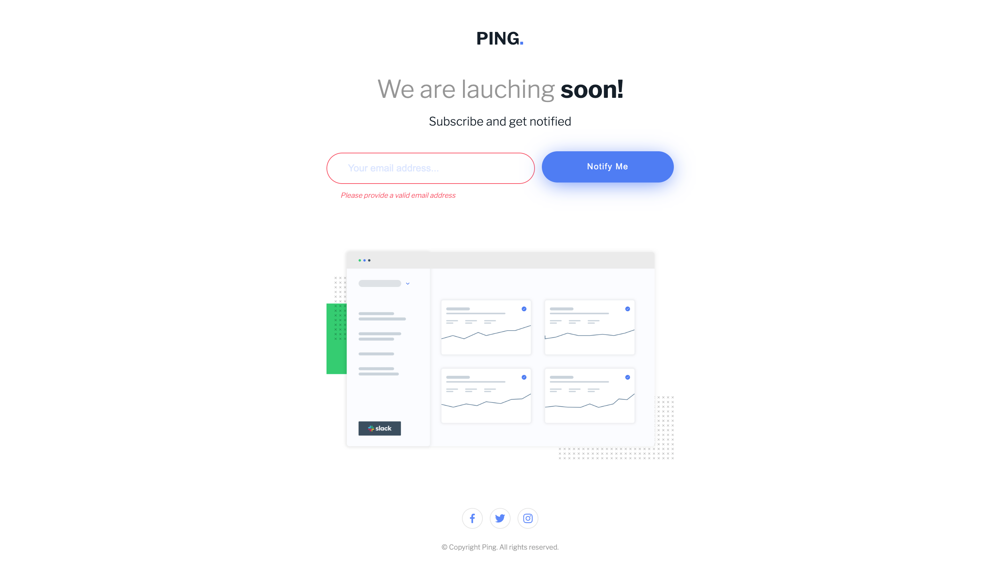

# PING Coming Soon Page
Esta es una solución de [Ping single column coming soon page on Frontend Mentor](https://www.frontendmentor.io/challenges/ping-single-column-coming-soon-page-5cadd051fec04111f7b848da). 

## Tabla de contenidos

- [Resumen](#resumen)
    - [Desafio](#desafio)
    - [Screenshots](#screenshots)
    - [Links](#links)
- [Proceso](#proceso)
    - [Hecho con](#hecho-con)
    - [Lo que aprendí](#lo-que-aprendí)

## Resumen

### Desafío

Los usuarios deben ser capaces de:

- Visualizar adecuadamente el diseño, tanto en mobile como en desktop.
- Ver los elementos interactivos de la página.
- Ingresar su correo electrónico y recibir un mensaje si es que escribieron un correo inválido.
- Hacer click en el botón **Notify Me** y si su correo es válido ver el botón como **Thank you**.

### Screenshots

La vista mobile de la página con un width de 375px se ve de la siguiente manera:

Cuando el usuario ingresa un correo electrónico válido y toca el botón de **Notify Me**, verá el botón con el mensaje de **Thank you**. Si el usuario ingresa un correo electrónico inválido, por ejemplo, *hello@mail/com* recibirá un mensaje de error que indica que el correo es inválido.

Mientras que si el usuario usa un desktop, la vista se amplía:

En esta situación, cuando el usuario hace mueve el mouse sobre los elementos interactivos como el botón **Notify Me** verá un efecto de movimiento y sobre los íconos de redes sociales, verá una inversión de color en esos elementos.

Cuando el usuario ingresa un correo inválido también recibirá un mensaje de error, pero al ser una vista desktop, los elementos tienen un ligero desplazamiento.

### Links

- Solución en Frontend Mentor: [Frontend Mentor](https://www.frontendmentor.io/solutions/ping-coming-soon-page-vWHymU1kNl)
- Live Site: [GitHub Pages](https://dgoperales.github.io/ping-coming-soon-page/)

## Proceso

### Hecho con

- HTML5
- CSS3
- JavaScript
- Flexbox
- CSS Grid
- Mobile First 

### Lo que aprendí

Con este desafío continué con el aprendizaje en manipulación del DOM. Para este ejercicio el reto era desplazar un mensaje de error cuando se cumplía una condición (ingresa un correo inválido).

Usando JavaScript aprendí a recibir texto ingresado por el usuario en un input y comprobar si cumple las condiciones que se establecieron para evaluar el texto como un correo válido o inválido.

> No pares de aprender.